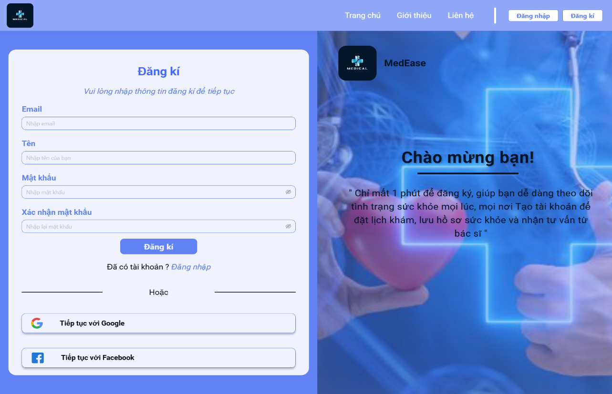
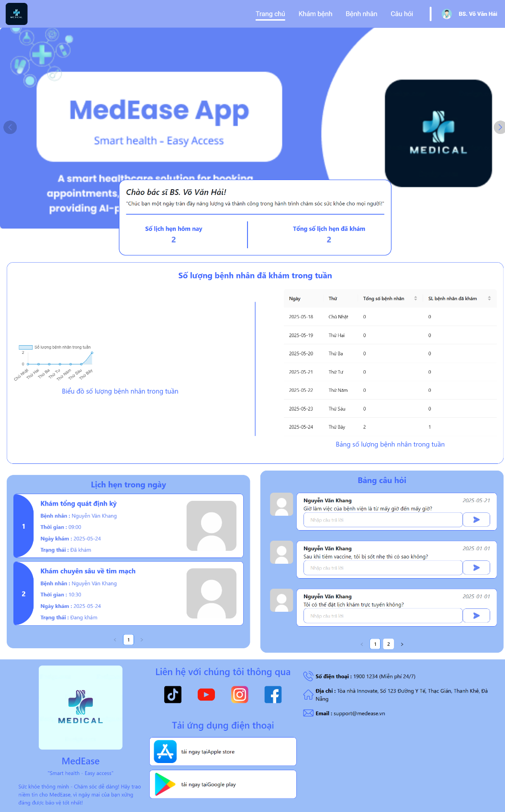
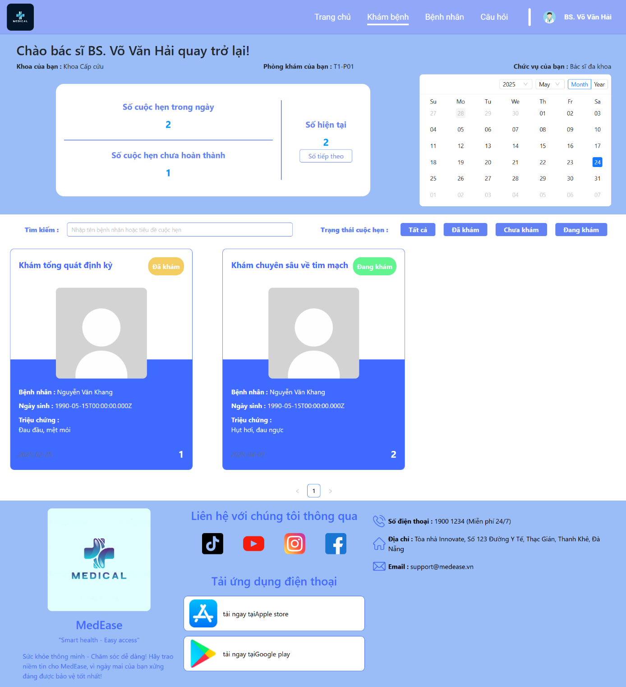
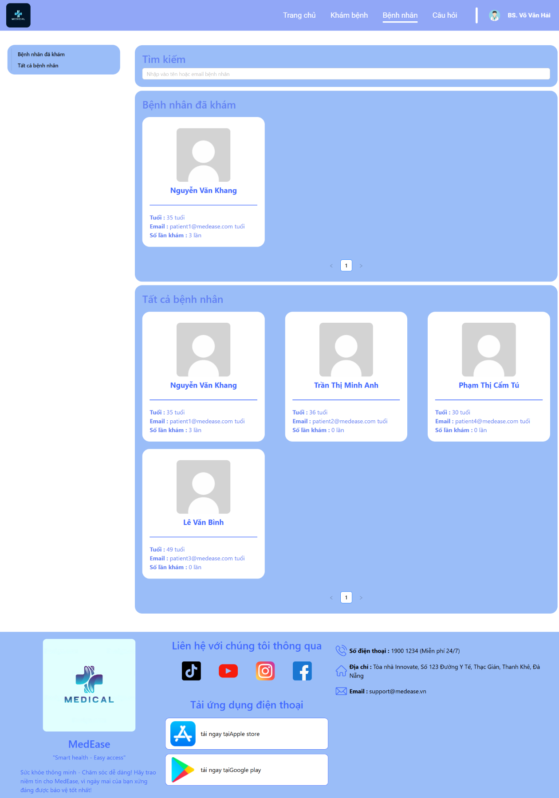
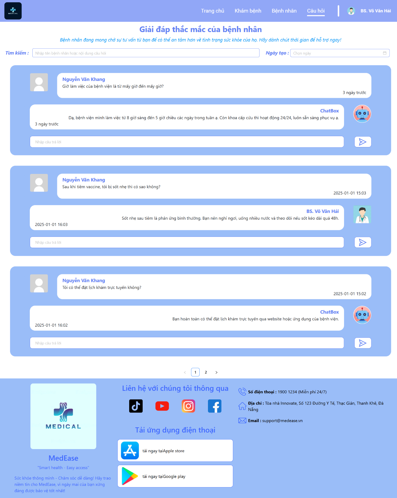
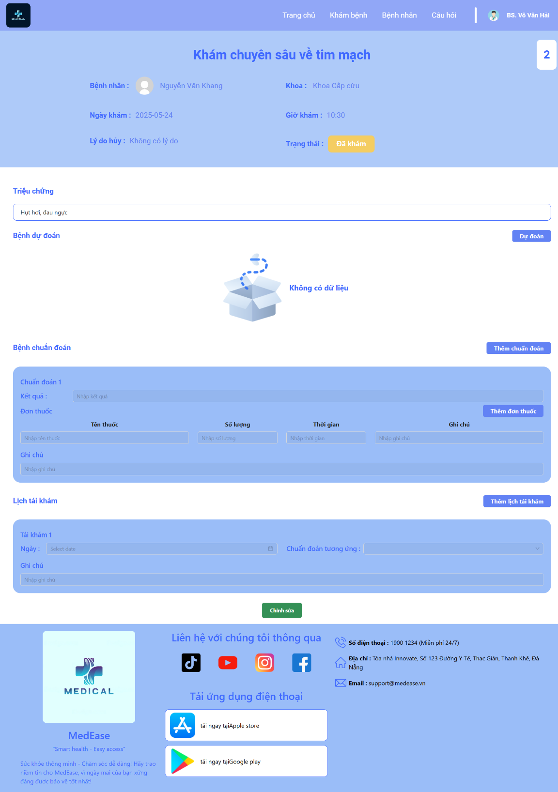
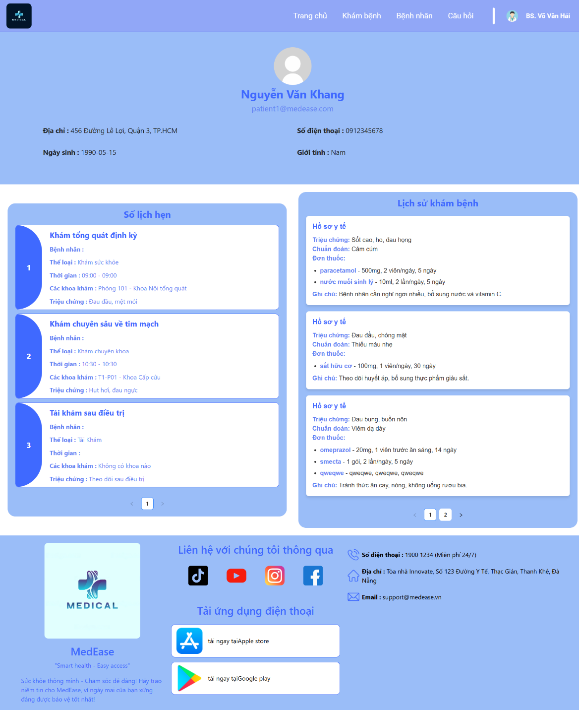
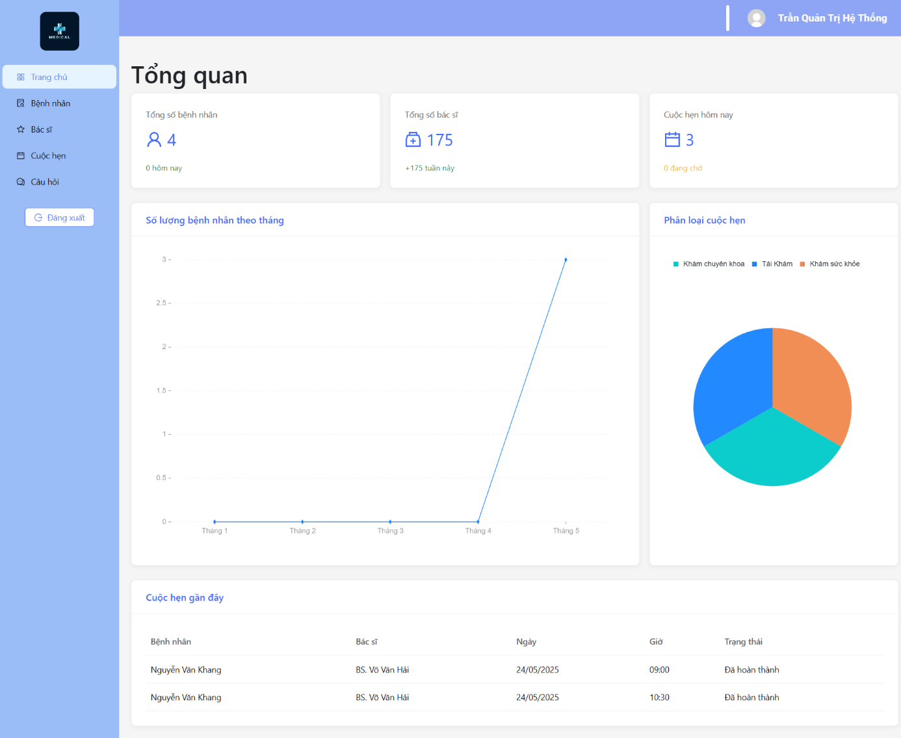
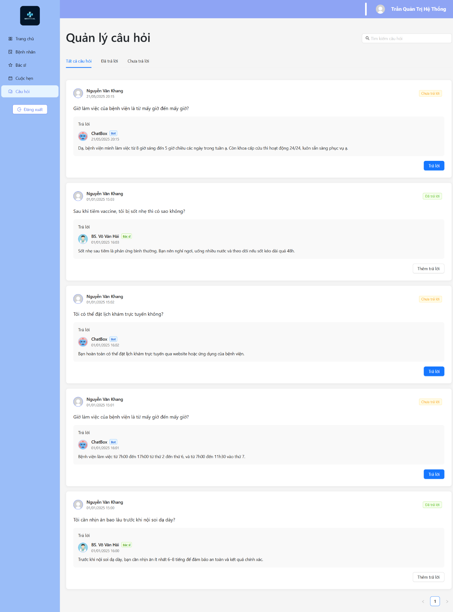
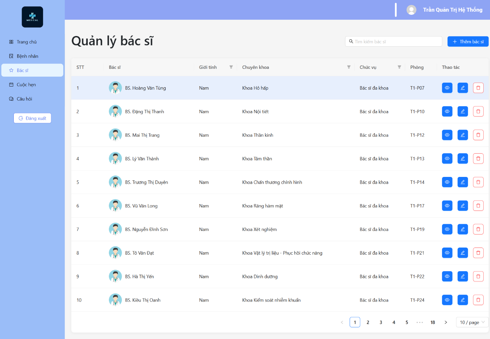

# 💻 MedEase – Frontend


## 📌 Overview

This is the frontend of **MedEase**, a smart healthcare platform for:

- 👤 Patient and doctor user portals
- 📅 Appointment booking
- 📁 Medical record management
- 🤖 AI health consultations
- 💳 Integrated payment experiences

Built using **React**, **Vite**, **Ant Design**, and **Bootstrap**, the frontend communicates with a powerful NestJS backend API.

---

## 🧰 Technologies Used

| Tech Stack | Purpose |
|------------|---------|
| [React 19](https://react.dev) | UI development |
| [Vite 6](https://vitejs.dev) | Fast dev server and build tool |
| [Ant Design 5](https://ant.design/) | UI components |
| [Bootstrap 5](https://getbootstrap.com/) | Responsive layout and styling |
| [Axios](https://axios-http.com/) | API communication |
| [React Router 7](https://reactrouter.com/) | Routing/navigation |
| [React Toastify](https://fkhadra.github.io/react-toastify/) | Notifications |
| [Chart.js](https://www.chartjs.org/) | Data visualization |
| [Swiper](https://swiperjs.com/) | Carousel/sliders |
| [Sass](https://sass-lang.com/) | Styling with variables and nesting |

---

## ⚙️ Requirements

- **Node.js** >= 18.x
- **npm** >= 9.x
- **Git** (optional)

---

## 🛠️ Getting Started

### 1. Clone the repository

```bash
git clone https://github.com/DungNguyen1702/MedEase.git
cd frontend
```

### 2. Install dependencies

```bash
npm install
```

### 3. Setup environment variables

```bash
cp .env.example .env
```

Then fill out `.env`:

```env
VITE_API_URL=http://localhost:8000       # Your backend API URL
VITE_REDIRECT_URL=http://localhost:5173  # Frontend host (for OAuth or redirects)
```

> You can add other environment variables as needed for deployment.

---

## ▶️ Running the App

### Development mode (with hot-reload)

```bash
npm run dev
```

### Build for production

```bash
npm run build
```

### Preview production build

```bash
npm run preview
```

---

## 📁 Project Structure

```
src/
├── assets/           # Images and static files
├── components/       # Reusable UI components
├── constants/        # constants
├── context/          # redifined in reactjs
├── data/             # fake data using when developing
├── utils/            # Helpers/validators
├── views/            # Page-level components (routes)
└── App.jsx           # Main app entry
```

---

## 🔒 Authentication

- Token-based (JWT)
- Role-based access (Patient, Doctor, Admin)
- Handled via `axios` interceptors and route guards

---

## 📑 Features Implemented

- Patient/doctor profile management
- Avatar upload using `FormData`
- Responsive layout (mobile-first)
- Charts for health data
- AI assistant popup with chat log

---
## 🌐 Website Screenshots

<div style="display: grid; grid-template-columns: repeat(auto-fit, minmax(200px, 1fr)); gap: 16px;">

  <div style="display: flex; justify-content: center; align-items: center; overflow: hidden; height: 200px; border: 1px solid #ccc; border-radius: 8px;">
    
  </div>
  <div style="display: flex; justify-content: center; align-items: center; overflow: hidden; height: 200px; border: 1px solid #ccc; border-radius: 8px;">
    
  </div>
  <div style="display: flex; justify-content: center; align-items: center; overflow: hidden; height: 200px; border: 1px solid #ccc; border-radius: 8px;">
    
  </div>
  <div style="display: flex; justify-content: center; align-items: center; overflow: hidden; height: 200px; border: 1px solid #ccc; border-radius: 8px;">
    
  </div>
  <div style="display: flex; justify-content: center; align-items: center; overflow: hidden; height: 200px; border: 1px solid #ccc; border-radius: 8px;">
    
  </div>
  <div style="display: flex; justify-content: center; align-items: center; overflow: hidden; height: 200px; border: 1px solid #ccc; border-radius: 8px;">
    
  </div>
  <div style="display: flex; justify-content: center; align-items: center; overflow: hidden; height: 200px; border: 1px solid #ccc; border-radius: 8px;">
    
  </div>
  <div style="display: flex; justify-content: center; align-items: center; overflow: hidden; height: 200px; border: 1px solid #ccc; border-radius: 8px;">
    
  </div>
  <div style="display: flex; justify-content: center; align-items: center; overflow: hidden; height: 200px; border: 1px solid #ccc; border-radius: 8px;">
    
  </div>
  <div style="display: flex; justify-content: center; align-items: center; overflow: hidden; height: 200px; border: 1px solid #ccc; border-radius: 8px;">
    
  </div>
  <div style="display: flex; justify-content: center; align-items: center; overflow: hidden; height: 200px; border: 1px solid #ccc; border-radius: 8px;">
    
  </div>
  <div style="display: flex; justify-content: center; align-items: center; overflow: hidden; height: 200px; border: 1px solid #ccc; border-radius: 8px;">
    
  </div>

</div>

---

## 👨‍💻 Author

- Nguyễn Văn Dũng  
- GitHub: [@DungNguyen1702](https://github.com/DungNguyen1702)

---

## 📄 License

This project is **UNLICENSED** – internal or academic use only.
