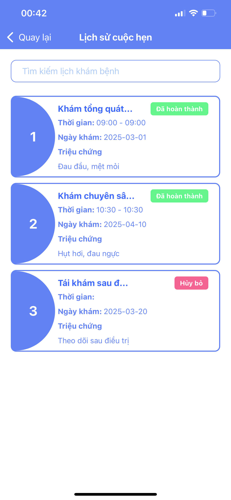
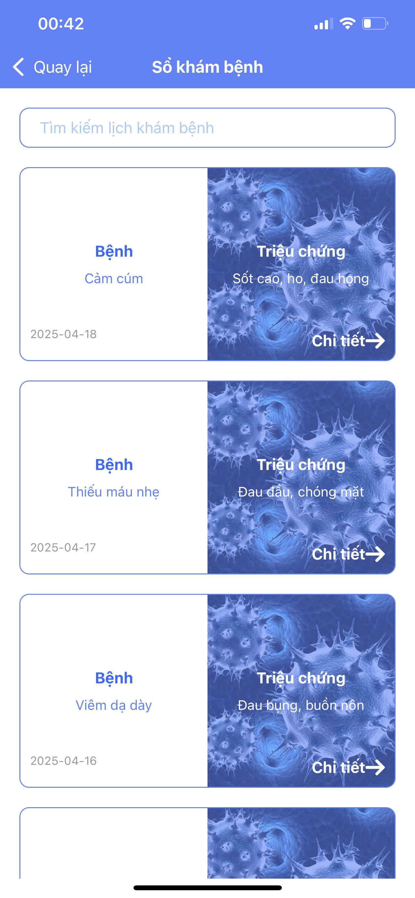
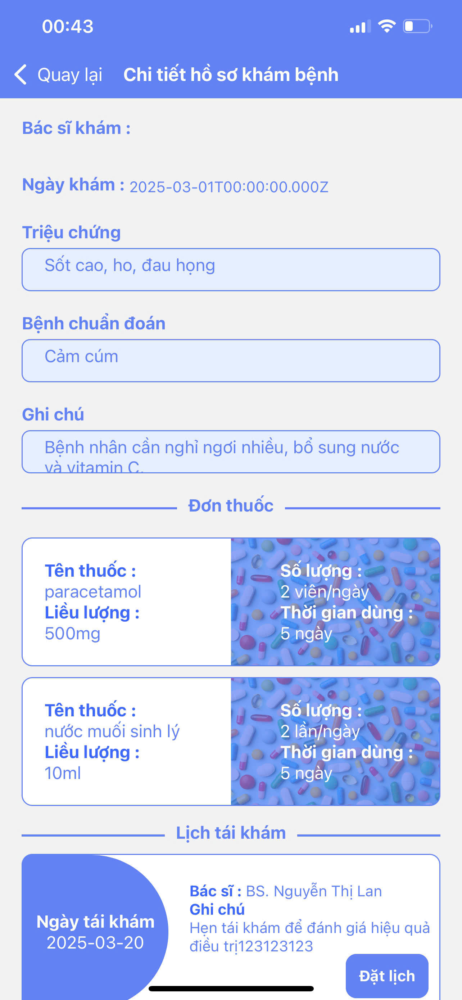
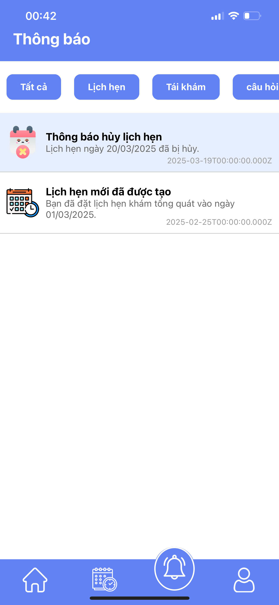

# 📱 MedEase – Mobile App


## 📌 Overview

**MedEase Mobile** is a cross-platform mobile application that helps users easily:

- 👩‍⚕️ Book medical appointments
- 📁 Manage personal health records
- 🤖 Consult with AI-powered virtual doctors
- 🧾 View medical prescriptions and history
- 🔔 Get notifications & reminders

It is built using **React Native**, powered by **Expo** and **Expo Router**, with backend integration via RESTful APIs.

---

## 🧰 Technologies Used

| Tech/Library                          | Purpose                              |
|--------------------------------------|--------------------------------------|
| [React Native 0.79](https://reactnative.dev/)  | Mobile UI framework                |
| [Expo 53](https://expo.dev/)         | Toolchain for faster mobile development |
| [Expo Router 5](https://expo.github.io/router) | File-based routing for mobile apps |
| [Axios](https://axios-http.com/)     | HTTP client                          |
| [React Redux](https://redux-toolkit.js.org/) | State management                   |
| [Socket.IO](https://socket.io/)      | Real-time messaging                  |
| [Expo Image Picker](https://docs.expo.dev/versions/latest/sdk/imagepicker/) | Upload avatars and documents        |
| [React Native Picker Select](https://github.com/lawnstarter/react-native-picker-select) | Custom dropdowns                  |

---

## ⚙️ Requirements

- **Node.js** >= 18.x
- **npm** >= 9.x
- **Expo CLI** installed globally:  
  ```bash
  npm install -g expo-cli
  ```
- Android Studio / Xcode (for physical or emulator testing)

---

## 🚀 Getting Started

### 1. Clone the repository

```bash
git clone https://github.com/DungNguyen1702/MedEase.git

cd mobile
```

### 2. Install dependencies

```bash
npm install
```

### 3. Configure environment variables

Create a `.env` file in the root folder based on `.env.example`:

```env
EXPO_PUBLIC_API_URL=
EXPO_PUBLIC_WEB_URL=
EXPO_PUBLIC_API_ROOT_REDIRECT_URL=
EXPO_PUBLIC_API_AI_URL=
```

> ⚠️ Make sure to restart Expo after changing `.env`.

---

## 📱 Running the App

### Start in development mode:

```bash
npm run start
```

Then:

- Press `a` to open on Android emulator
- Press `i` to open on iOS simulator (macOS only)
- Scan QR code using the Expo Go app (iOS/Android)

---

## 🧪 Running Tests

```bash
npm run test
```

> Uses `jest-expo` preset for unit and snapshot testing.

---

## 📁 Folder Structure

```
mobile/
├── api/                 # Calling api from backend
├── app/                 # Screens and routes (Expo Router)
├── assets/              # Containing images, fonts, icons
├── components/          # Shared UI components
├── constants/           # Global constants
├── data/                # Containing fake data using when developing
├── hooks/               # Redefined function in react native
├── redux/               # Redux
├── utils/               # Validators, formatters, etc.
└── app.json             # Expo config
```

---

## 🔐 Authentication

- Token-based authentication with Bearer tokens
- Token stored in secure local storage
- Role-based routing via guards

---

## 🔄 API Integration

- RESTful endpoints using Axios
- Supports image upload with `FormData`
- Real-time chat using Socket.IO

---
## 📱 Mobile Screenshots

<div style="display: grid; grid-template-columns: repeat(auto-fit, minmax(200px, 1fr)); gap: 16px;">

  <div style="display: flex; justify-content: center; align-items: center; overflow: hidden; height: 200px; border: 1px solid #ccc; border-radius: 8px;">
    
  </div>
  <div style="display: flex; justify-content: center; align-items: center; overflow: hidden; height: 200px; border: 1px solid #ccc; border-radius: 8px;">
    
  </div>
  <div style="display: flex; justify-content: center; align-items: center; overflow: hidden; height: 200px; border: 1px solid #ccc; border-radius: 8px;">
    
  </div>
  <div style="display: flex; justify-content: center; align-items: center; overflow: hidden; height: 200px; border: 1px solid #ccc; border-radius: 8px;">
    
  </div>
  <div style="display: flex; justify-content: center; align-items: center; overflow: hidden; height: 200px; border: 1px solid #ccc; border-radius: 8px;">
    
  </div>
  <div style="display: flex; justify-content: center; align-items: center; overflow: hidden; height: 200px; border: 1px solid #ccc; border-radius: 8px;">
    
  </div>
  <div style="display: flex; justify-content: center; align-items: center; overflow: hidden; height: 200px; border: 1px solid #ccc; border-radius: 8px;">
    
  </div>
  <div style="display: flex; justify-content: center; align-items: center; overflow: hidden; height: 200px; border: 1px solid #ccc; border-radius: 8px;">
    
  </div>
  <div style="display: flex; justify-content: center; align-items: center; overflow: hidden; height: 200px; border: 1px solid #ccc; border-radius: 8px;">
    
  </div>
  <div style="display: flex; justify-content: center; align-items: center; overflow: hidden; height: 200px; border: 1px solid #ccc; border-radius: 8px;">
    
  </div>
  <div style="display: flex; justify-content: center; align-items: center; overflow: hidden; height: 200px; border: 1px solid #ccc; border-radius: 8px;">
    
  </div>
  <div style="display: flex; justify-content: center; align-items: center; overflow: hidden; height: 200px; border: 1px solid #ccc; border-radius: 8px;">
    
  </div>
  <div style="display: flex; justify-content: center; align-items: center; overflow: hidden; height: 200px; border: 1px solid #ccc; border-radius: 8px;">
    
  </div>
  <div style="display: flex; justify-content: center; align-items: center; overflow: hidden; height: 200px; border: 1px solid #ccc; border-radius: 8px;">
    
  </div>
  <div style="display: flex; justify-content: center; align-items: center; overflow: hidden; height: 200px; border: 1px solid #ccc; border-radius: 8px;">
    
  </div>

</div>

---

## 👤 Author

- Nguyễn Văn Dũng  
- GitHub: [@DungNguyen1702](https://github.com/DungNguyen1702)

---

## 📄 License

This project is **UNLICENSED** – for academic or internal use only.